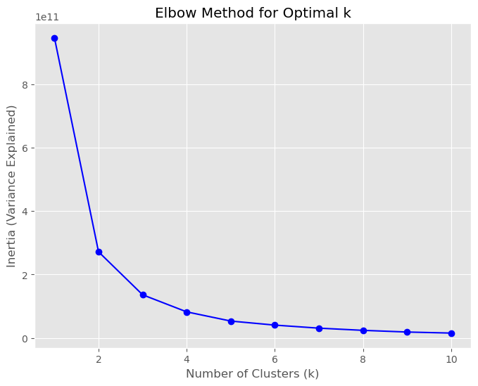

# CustomerAnalysis

The data set is downloaded from [Kaggle](https://www.kaggle.com/datasets/imakash3011/customer-personality-analysis)

## Approach

- Importing The Libraries 
  ```python
  import pandas as pd

  import matplotlib.pyplot as plt
  import seaborn as sb

  plt.style.use('ggplot')

  from sklearn.cluster import KMeans
  from tqdm import tqdm
  ```
- Loading the csv with `pd.read_csv(fileName)`
- Turns out the file itself is messed up. The csv is not in Comma Separated structure. Therefore Pandas cannot read it correctly
### Cleaning
- Fortunately, each collumn is separated with `\t` or tab. Which indicates pattern that can be used to split
- For the Columns we can use `dataframe.columns[0].split()` to gather the columns name. Because the column name doesnt contain spaces we could use `.split()` directly.
- For the rows or values. We could loop in and store it on temporary list
  ```python
  temp=[]
  for item in df.values:
      temp.append(item[0].split("\t"))
  ```
- Then we can create new dataframe using column and value we got 
  ```python
  df = pd.DataFrame(
    columns=columns,
    data=temp,
  )
  ```
- using `df.info()` to gather brief info from the data
- Turns put All the type column are object-like or string. But i couldnt change directly to int type on Income column. This caused by there are values that actually `null` but typed as `''`. Thus I should fill it with average of income
  ```python
  temp = 0
  count=0
  for incomes in df.Income:
      if incomes != '':
          temp+=int(incomes)
          count+=1
  averageIncome = (round((temp/count),2))
  ```
  using block of code above, i able to count the average of non null
- Then i can change the type of each columns
  
### Anomaly Detection

- While performing EDA, i encounter outliers for example on income. Therefore i curious if the outliers appears on other tables
- Using this sourced [Formula](https://builtin.com/data-science/boxplot) and apply it to function below
  ```python
  def identifyOutliers(data,col):
    """
    using Q1-3/2IQR to calculate "Minimum" and using Q3+3/2IQR to calculate "Maximum"
    """
    
    q1 = data[col].quantile(0.25)
    q3 = data[col].quantile(0.75)
    iqr = data[col].quantile(0.75) - data[col].quantile(0.25)    
    
    # Source of Formula : https://builtin.com/data-science/boxplot
    minims = q1-((3/2)*iqr)
    maxes = q3+((3/2)*iqr)
    
    # Based on how Boxplot works 
    if (data[col].min() < minims) or (data[col].max() > maxes):
        # prevent True-False Column categorized as Outliers
        if (data[col].min() != 0) and (data[col].max() != 1):
            data[col].plot(kind='box',title=col,vert=False)
            plt.show()

    return True   
  ```
  Function above will detect the outliers. But because the outliers are number only related issue. I should select the column before loop it
  
  ```python
  numerics = df.select_dtypes(include=['number'])

  for cols in numerics.columns:
      identifyOutliers(df,cols)
  ```
  The code above will handle number only columns
- Because the total amount of outliers are less than 1% and asessed not important. Im deciding to drop / delete the rows
  ```python
  outliers = df[(df["Income"] > df["Income"].quantile(0.75)+((3/2)*(df["Income"].quantile(0.75)-df["Income"].quantile(0.25)))) |
   (df["Year_Birth"] < df["Year_Birth"].quantile(0.25)-((3/2)*(df["Year_Birth"].quantile(0.75)-df["Year_Birth"].quantile(0.25))))]
  ```
  using the code above. I capable to get issued rows
- then drop it using `df.drop(labels=outliers.index,axis=0)` 
### Clustering

- For the modelling (cluster) i utilizing K-Means. And using elbow method to get optimal K-Value
- Before applying to K-Means, there are category-like column in string format
- using `df2 = pd.get_dummies(df2,columns=["Education","Marital_Status"],prefix='Category')`. I able to solve related issue
- Using Elbow Method. I got the optimal K on K=2
  
- Then i apply K-Means with K=2. After getting the Cluster i add it to column as class
- After deep-look to class and other column. I Can summarize that
  1. Class 0 : are the group that has lesser income and lesser amount of Shopping
  2. Class 1 : are the group that has greater income and greater amount of Shopping
- After that, im trying without the income, and only with the amount of purchases like `MntWines`,`MntFishProducts`,etc
- The result of K-Means remain the Same.